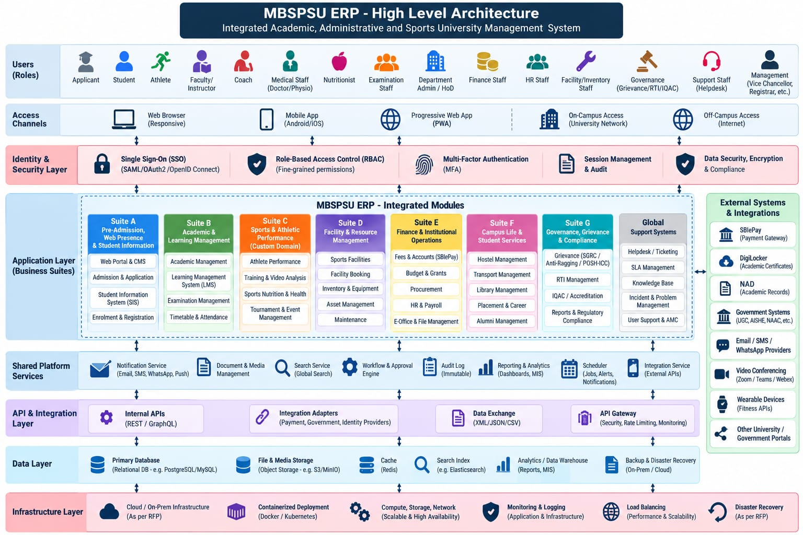

# Architecture

Education OS is **one configurable higher-education platform**: a core, common suites every
institution runs, specialized suites per field, and an institution profile that says which are on.
Sports is the first field; arts, music, design, film, medical, law, engineering, management,
research and others use the same foundation ([ADR-0004](docs/architecture/adr/0004-institution-profiles.md),
[institution-types.md](docs/architecture/institution-types.md)).

```
platform/ (core)  →  common suites  →  specialized suites  →  institution profile
```

The diagram below is the first customer's view, a sports university. Each layer maps to one folder.



## Layers to folders

| Diagram layer | Folder | Notes |
|---|---|---|
| Users (roles) | `platform/identity/contracts/permissions.yaml` + each module's `contracts/permissions.yaml` | Roles are compositions of module permissions |
| Access channels | `apps/web` (browser + PWA), `apps/mobile` | Thin shells that compose module UIs |
| Identity & security | `platform/identity`, `platform/api-gateway`, `platform/audit` | SSO, RBAC, MFA, sessions, audit |
| Application layer (suites A–G, Global) | `modules/<domain>/<module>` | One folder per box in the diagram |
| Shared platform services | `platform/*` | Notification, documents, search, workflow, audit, reporting, scheduler, integration hub |
| API & integration layer | `platform/api-gateway`, `platform/integration-hub`, `integrations/*` | Gateway in front, adapters behind |
| Data layer | `data/*` conventions, `<module>/db/` migrations | Schema-per-module |
| Infrastructure | `infra/*` | Containers, k8s, monitoring, LB, DR |
| External systems | `integrations/*` | One adapter per external system |

## Domain grouping of feature modules

| Domain folder | Diagram suite | Tier | Modules |
|---|---|---|---|
| `student-lifecycle` | Suite A | common | web-portal-cms, admissions, student-information, enrolment-registration |
| `academics` | Suite B | common | academic-management, lms, examinations, timetable-attendance |
| `sports` | Suite C | specialized (sports) | athlete-performance, training-video-analysis, sports-nutrition-health, tournament-events |
| `facilities` | Suite D | common, except sports-facilities | sports-facilities, facility-booking, inventory-equipment, asset-management, maintenance |
| `finance-operations` | Suite E | common | fees-accounts, budget-grants, procurement, hr-payroll, e-office |
| `campus-life` | Suite F | common | hostel, transport, library, placement-career, alumni |
| `governance` | Suite G | common | grievance, rti, iqac-accreditation, regulatory-reports |
| `support` | Global | common | helpdesk, sla-management, knowledge-base, incident-management, amc-vendor-support |

Domain folders are grouping only. They hold no shared code. Two modules in the same
domain are as isolated from each other as two modules in different domains.

## Tiers and institution profiles

Every manifest declares `tier: core | common | specialized` (and `field:` when specialized).

| Tier | Meaning | Lives in |
|---|---|---|
| core | Platform services every deployment needs | `platform/` |
| common | Modules any institution runs: admissions, academics, exams, finance, campus life, governance, support, generic facilities | `modules/*` |
| specialized | Behaviour specific to one field, such as sports | `modules/*` with `field:` |

An **institution profile** in `platform/identity/config/profiles/<profile>.yaml` lists the
suites, modules, integrations, roles, dashboard layouts and field vocabulary for one kind of
institution. Installing Education OS for an institution means choosing a profile:

- `apps/*` take their enabled-module list from the profile.
- `platform/api-gateway` refuses routes of modules the profile does not list. A disabled suite is
  blocked server-side, not only hidden in the UI.
- Roles and dashboards are data in the profile, never hard-coded.

`sports-college` is the only profile today. A new institution type starts as a profile.

## Generic patterns behind specialized suites

Fifteen institution types reduce to eight recurring patterns. Each is built once as a common
module and takes its vocabulary from the profile; a specialized module is written only for
behaviour a pattern cannot express. The mapping from institution type to pattern is in
[institution-types.md](docs/architecture/institution-types.md).

| Pattern | Examples across fields |
|---|---|
| Resource booking | Practice rooms, studios, labs, pitches, training kitchens, equipment |
| Specialized inventory | Instruments, costumes, lab gear, art materials, sports equipment |
| Portfolio | Artist, design, showreel, teaching portfolio, publications |
| Selection process | Auditions, casting, squad selection, moot court teams |
| Productions and events | Tournaments, performances, exhibitions, screenings, hackathons |
| Projects | Capstone, film, live business, research, artwork |
| Field training | Clinical rotations, teaching practice, farm rotations, internships |
| Skill progress | Athlete metrics, dance progression, practicum assessment |

## Dependency direction

```
apps  ──►  modules  ──►  packages
            │               ▲
            ▼               │
         platform  ─────────┘
            │
            ▼
       integrations
```

Allowed:
- `apps` import modules, platform, packages.
- `modules` import `packages` only. They reach platform services via `packages/sdk`.
- `platform` imports `packages`, and other platform services only when declared.
- `integrations` import `packages` and implement ports from `platform/integration-hub`.
- `packages` import nothing from this repo.

Forbidden, and to be enforced by a lint rule in CI once the stack is chosen:
- module → module code import (any direction, any domain)
- platform → module
- packages → anything in this repo

## How modules talk to each other

1. **Synchronous:** HTTP calls to the other module's published API (its `contracts/openapi.yaml`),
   routed through the gateway. Clients are generated from the contract, never hand-written against internals.
2. **Asynchronous:** domain events on `platform/event-bus`. A module publishes events listed in its
   `contracts/events.yaml` and declares what it consumes in `module.yaml`.
3. **Shared reference data** (academic year, org units, person identity) lives in `packages/contracts`
   as schemas, with `platform/identity` and `modules/student-lifecycle/student-information` as the systems of record.

Example: `fees-accounts` does not query the admissions tables. It subscribes to
`admissions.application.accepted` and creates a fee invoice.

## Data ownership

- Each module owns one database schema named after the module. Only that module's migrations touch it.
- No cross-schema foreign keys. Reference other modules' entities by ID plus a cached copy of the fields you need, refreshed by events.
- Documents and media go through `platform/documents`, never direct bucket access.
- Search indexes are owned by the module that publishes the data; `platform/search` only hosts them.

## Security

- Every request enters via `platform/api-gateway`, which validates the session and attaches the identity.
- Modules check permissions by key (`<module>:<resource>:<action>`) via the identity SDK. They never inspect roles directly.
- Every state change writes to `platform/audit`. Audit records are immutable.
- MFA, SSO (SAML / OAuth2 / OIDC) and session rules are configured once in `platform/identity`.

## Role dashboards

The 15 roles in the diagram each get a dashboard, but there is only one dashboard page.

| Piece | Where | Owner |
|---|---|---|
| Widget contract (`DashboardWidget`, `WidgetFrame`, `WidgetRegistry`) | `packages/ui-kit/src/widget/` | Architecture and platform |
| Role layouts, one YAML per role listing widget ids | `platform/identity/config/dashboards/` | Architecture and platform |
| Dashboard shell that reads the layout and renders the widgets | `apps/web/src/dashboard/` | Apps, infra and QA |
| Widgets themselves | `<module>/frontend/src/widgets/index.ts` | The module's owner |

A widget is module code: it imports only from its module and `packages/`, fetches through the
module's generated client, and declares the permission key it needs. The shell hides widgets the
viewer may not see and shows a "Not built yet" card for ids no enabled module exports.
Assignment and status: the Dashboard Assignment Plan doc.

## Deployment shapes

The same modules can be deployed three ways without code changes:

| Shape | How | When |
|---|---|---|
| Modular monolith | `apps/api` mounts the profile's modules in one process | Default. One deployment per institution |
| Grouped services | Several `apps/api` instances, each with a different `modules.enabled.yaml` | Scale hot suites (exams, fees) separately |
| Standalone module | Copy one module folder into another repo with `packages/` as a dependency | Reuse in a different product |

## Stack
React + TypeScript frontend, FastAPI backend, PostgreSQL database. See [ADR-0002](docs/architecture/adr/0002-tech-stack.md).

## Open decisions
See [docs/architecture/adr/](docs/architecture/adr/). Pending: event broker, workflow engine, identity provider,
and the gateway's per-route module-enabled check from ADR-0004.
